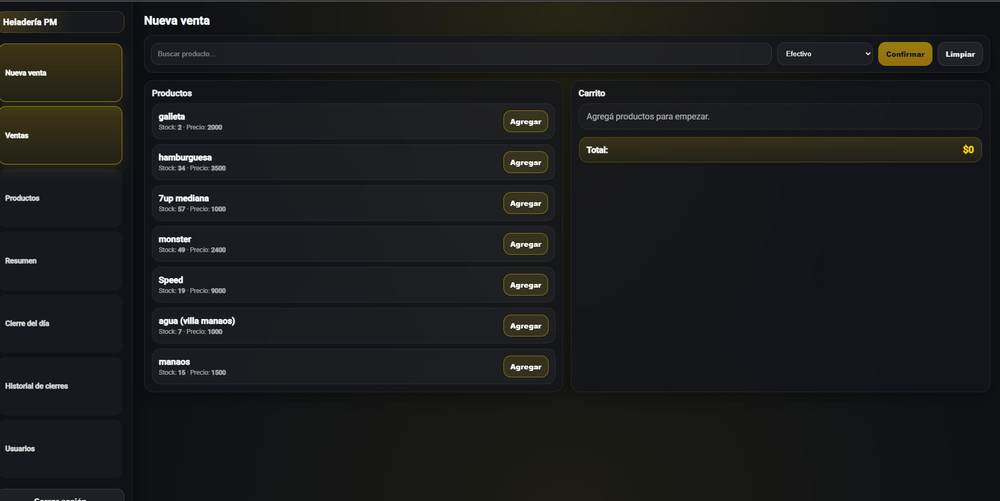
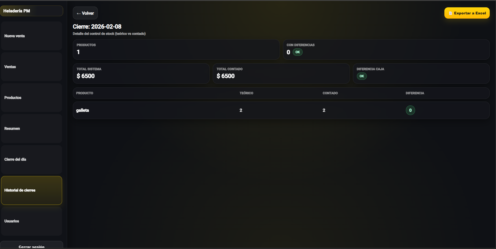
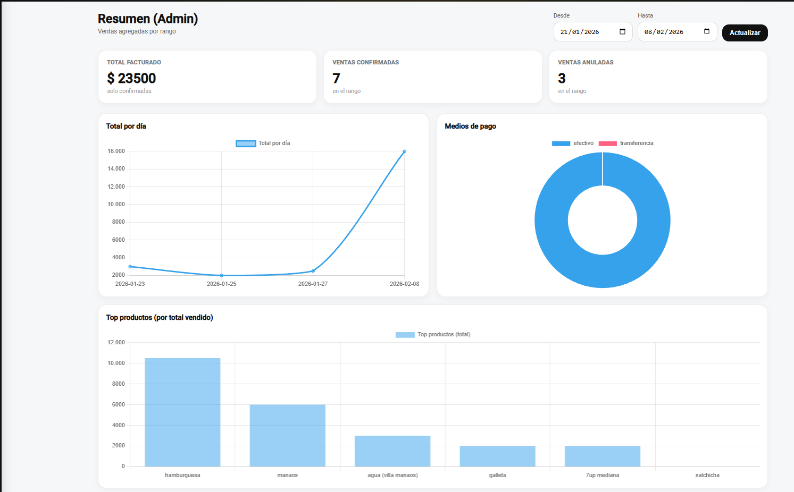

# 🍦 Sistema de Gestión de Ventas y Cierres – Heladería PM

Sistema web desarrollado a medida para una **heladería**, orientado al control diario de ventas, stock por unidades y cierres de caja, reemplazando el control manual por WhatsApp, fotos y cuaderno.

---

## 🎯 Objetivo del sistema

Brindar a la heladería una herramienta simple, clara y confiable para:

- Registrar ventas diarias
- Controlar stock por producto (potes, cucuruchos, bebidas, etc.)
- Realizar cierres diarios comparando **sistema vs realidad**
- Detectar diferencias de stock y de caja
- Obtener reportes y estadísticas para la toma de decisiones

---

## 🧑‍💼 Roles del sistema

### 👑 Administrador

- Gestión completa del sistema
- Alta, baja y modificación de productos
- Gestión de usuarios
- Acceso a estadísticas y reportes
- Visualización de todos los cierres
- Exportación de cierres a Excel

### 👤 Empleado

- Carga de ventas
- Visualización de productos
- Cierre del día (conteo físico)

---

## 🧩 Módulos de la aplicación

### 🛒 Ventas

- Registro de ventas por producto
- Medios de pago: efectivo, transferencia, point
- Cálculo automático de totales
- Posibilidad de **anular ventas** (no se borran, quedan auditadas)

📸 **Imagen sugerida**


---

### 📦 Productos

- Productos simples (ej: potes, cucuruchos, bebidas)
- Control por **unidades vendidas**, no por sabores
- Stock teórico automático según ventas

> ℹ️ El sistema está adaptado a la realidad de la heladería:
> los sabores se manejan en baldes, por lo que el control se realiza sobre **potes y presentaciones**, no por sabor individual.

📸 **Imagen sugerida**



---

### 💰 Cierre del día

Funcionalidad clave del sistema.

El cierre permite:

- Ver stock teórico calculado por el sistema
- Ingresar stock contado físicamente
- Calcular diferencias automáticamente
- Registrar **total de ventas del sistema**
- Ingresar **total de caja contado**
- Detectar diferencias de dinero

📸 **Imagen sugerida**

```md

```

---

### 📚 Historial de cierres

- Listado de cierres por fecha
- Visualización rápida de:
  - Productos con diferencias
  - Total sistema vs total contado
  - Diferencia de caja

📸 **Imagen sugerida**

```md

```

---

### 🔍 Detalle de cierre

- Detalle producto por producto
- Stock teórico vs contado
- Diferencias resaltadas visualmente
- Exportación del cierre a Excel

📸 **Imagen sugerida**



---

### 📊 Resumen y estadísticas (Admin)

Dashboard con información agregada:

- Total facturado por rango de fechas
- Ventas confirmadas y anuladas
- Medios de pago
- Ventas por día
- Top productos vendidos

📸 **Imagen sugerida**



---

## 🔐 Seguridad

- Autenticación con JWT
- Rutas protegidas por rol
- Backend valida todos los permisos
- El frontend solo muestra lo permitido según rol

---

## 🛠️ Tecnologías utilizadas

### Backend

- NestJS
- MongoDB + Mongoose
- JWT + Passport
- TypeScript

### Frontend

- Angular (standalone components)
- Guards por rol
- Http Interceptors
- Diseño moderno con enfoque dark UI

---

## 🔄 Flujo real de uso diario

1. El empleado registra las ventas durante el día
2. El sistema descuenta stock automáticamente
3. Al cierre:
   - Se cuentan productos físicos
   - Se ingresa dinero real en caja

4. El sistema muestra diferencias
5. El administrador revisa y exporta el cierre

---

## 📈 Beneficios para el negocio

- Eliminación de errores manuales
- Control claro de stock y dinero
- Historial ordenado y auditable
- Ahorro de tiempo
- Mejor toma de decisiones

---

## 📌 Estado del proyecto

✅ En producción / uso real

---

💡 _Proyecto desarrollado a medida según la operatoria real de la heladería._
